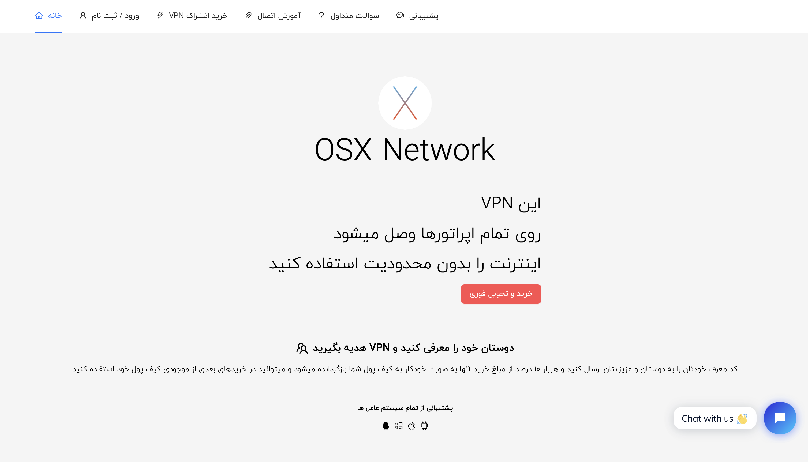
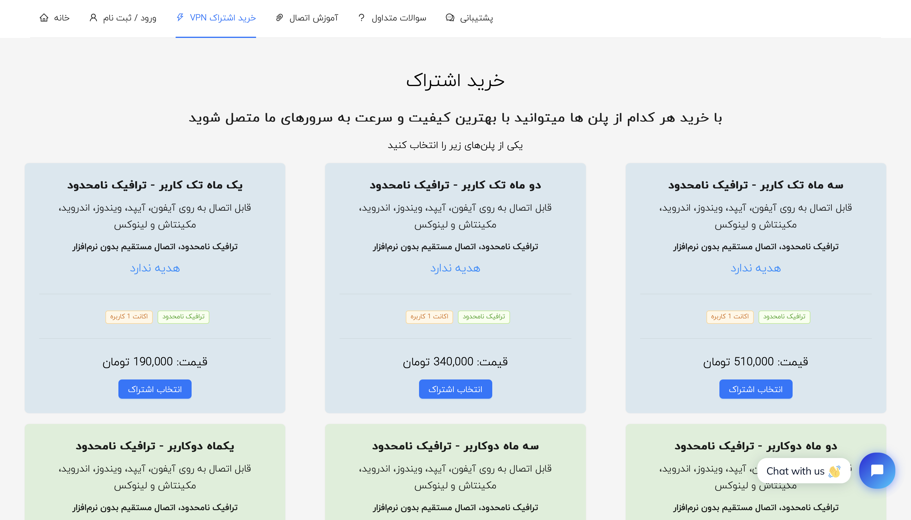

# README - OSXVPN VPN Platform

## Introduction
OSXVPN is a fully automated VPN subscription platform developed entirely in **JavaScript**, with a **Node.js backend** and a **PostgreSQL database**. The **frontend** is built using **React.js**, providing users with a seamless experience. This project is the result of my solo development efforts, covering both frontend and backend, as well as server-side configurations.

## Features
- **VPN Subscription Services**: Users can purchase **monthly subscriptions** for various VPN protocols including:
  - **OpenVPN**
  - **L2TP/IPSec**
  - **Cisco VPN**
  - **V2Ray (V2RAY)**
- **Automated User Authorization**:
  - The platform is fully integrated with **IBSNG**, ensuring seamless user authorization.
  - Upon subscription, an automatic request is sent to **IBSNG**, which manages user access and authentication across multiple servers.
  - VPN servers connect to IBSNG via **REST API**, enabling real-time authorization and account management.
- **Multi-Gateway Payment System**:
  - **NOWPayments** (for cryptocurrency transactions)
  - **Zarinpal** (local payment gateway)
  - **Perfect Money** (for alternative payments)
  - All transactions trigger an **automated subscription activation** within IBSNG.
- **Custom IBSNG Server Configurations**:
  - The platform is configured to integrate IBSNG for **OpenVPN, L2TP/IPSec, Cisco VPN, and V2Ray authentication**.
  - It supports advanced VPN authorization mechanisms, ensuring **automated user provisioning** across multiple servers.
- **User Dashboard**:
  - Users can manage their subscriptions, renew plans, and monitor their connection details.
  - Subscription plans are dynamically linked to IBSNG, ensuring a smooth user experience.

## Technology Stack
- **Frontend**: React.js
- **Backend**: Node.js (Express.js)
- **Database**: PostgreSQL
- **Authentication & Authorization**: IBSNG
- **Server Configuration**: Custom **VPN authorization scripts** integrated with IBSNG
- **Payment Integrations**: NOWPayments, Zarinpal, Perfect Money

## Live Demo
The official website is available at:
[http://osxnetwork.top/](http://osxnetwork.top/)

## Screenshots

## Contact
For any questions or collaborations, feel free to reach out!

